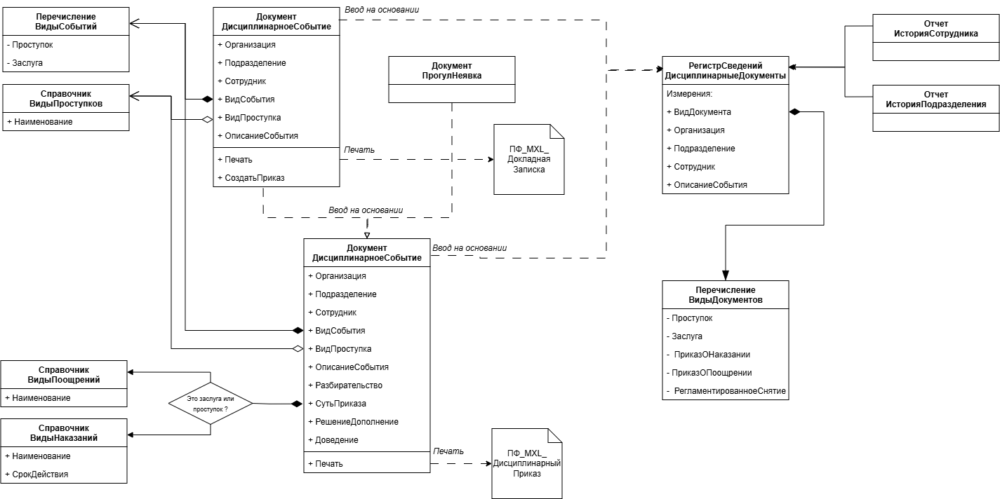
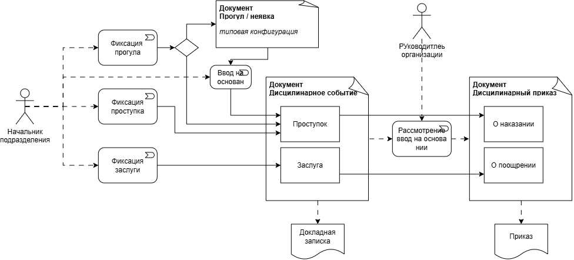
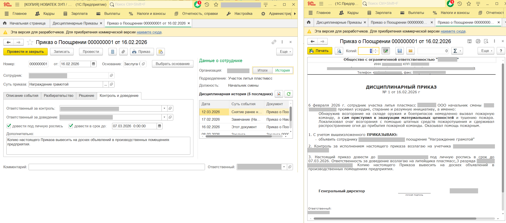

# Учет дисциплинарной практики в ЗУП 3.1 "Базовая"

Некоторые типовые конфигурации «1С» содержат в себе инструменты для ведения дисциплинарного учёта. Например 1С:ЗУП КОРП и 1С:ERP при включённом блоке «КОРП». Все это - тяжеловесные и дорогие продукты, неподъёмные и ненужные для небольших компаний. В качестве простой альтернативы предлагается небольшое расширение к ЗУП 3.1.

## Архитектура и функционал

Для фиксации проступков и заслуг, создания дисциплинарных приказов, в расширении служат два вида документов - «Дисциплинарное событие» и «Дисциплинарный Приказ». «Событие» создаётся непосредственным начальником и фиксирует сам факт проступка или заслуги. По сути, это аналог документа «Докладная записка». «Приказ» это уже факт наказания или поощрения – создаётся руководителем или уполномоченным должностям лицом.

В общем случае Событие служит основанием для Приказа. Но не всегда за проступком следует наказание, также как и не всегда поощрение требует обязательного предварительного написания Докладной записки. Также Приказ может вводится и на основании документа типовой конфигурации «Прогул». Ведь это тоже дисциплинарное событие.

Диаграмма связей объектов метаданных приведена на рисунке:

Для классификации событий, наказаний и поощрений служат справочники «Виды проступков», «Виды наказаний» и «Виды поощрений». Справочник «ВидыНаказаний» содержит предопределённые элементы соответствующие требованиям статьи 192 ТК РФ, а справочник «Виды поощрений» - предопределённый элемент «Снятие ранее наложенного взыскания». В случае, если Приказ о поощрении создаётся в отношении сотрудника, имеющего действующие взыскание, только этот вид поощрения может быть использован в документе.

Элементы справочника «ВидыНаказаний» имеют обязательный реквизит «СрокДействия», предполагающий установку срока действия взыскания в количестве месяцев. По истечении указанного срока взыскание автоматически снимается с помощью регламентного задания, создающего соответствующий документ без участия пользователя.
Для аналитики и отчётов служит регистр сведений «ДисциплинарныеДокументы» с измерениями «ВидДокумента», «Сотрудник», «Организация» и «Подразделение».
Карта маршрута пользователей при использовании подсистемы ниже:

Если к Событию или Приказу требуется приложить дополнительные материалы - скан-копии объяснительных, актов, фотографии – документы поддерживают механизм Присоединенных файлов. Также объекты расширения зарегистрированы в и в других основных подсистемах Библиотеки Стандартных Подсистем: Печать, НапоминанияПользователя, ДатыЗапретаИзменений, ОтчетОДвиженияхДокументах. Поддерживается многофирменный учет.

Спорным, но приятным дополнение к привычному функционалу типовых тиражных конфигураций стало использование в формах документов полей форматированного документа. Это позволило сделать печатные формы более яркими и читаемыми. Для оперативного принятия решений при составлении и просмотре документов на формы документов выведены краткие итоги дисциплинарной истории сотрудника.

Примеры интерфейса и печатных форм:

## Эффект от внедрения

Внедрение расширения позволило систематизировать дисциплинарный учет, повысить прозрачность и доступность информации о дисциплинарных событиях для руководителей всех уровней, обеспечить накопление и сохранность дисциплинарной итории. Кратно ускорить процесс подготовки документов.
